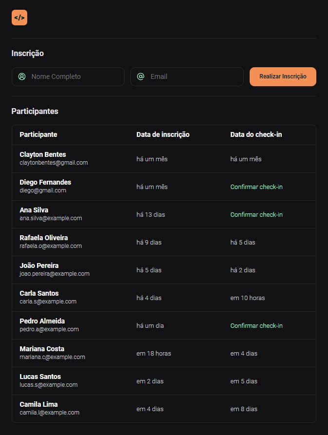

# Simples Front-end Sistema de Check-in

Este projeto é um simples front-end usando HTML/CSS/Javascript.

Projeto desenvolvido na Trilha de HTML/CSS/Javascript da NLW Unite da Rocketseat.

  

Disponível em: https://claytonbentes.github.io/html-css-js-nlw-unite/

## Tecnologias

Esse projeto foi desenvolvido com as seguintes tecnologias:

- HTML
- CSS
- JavaScript

## Projeto

Neste projeto foi desenvolvido uma versão simplificada de um sistema de check-in para eventos presenciais usando HTML/CSS/Javascript.

## Contato

